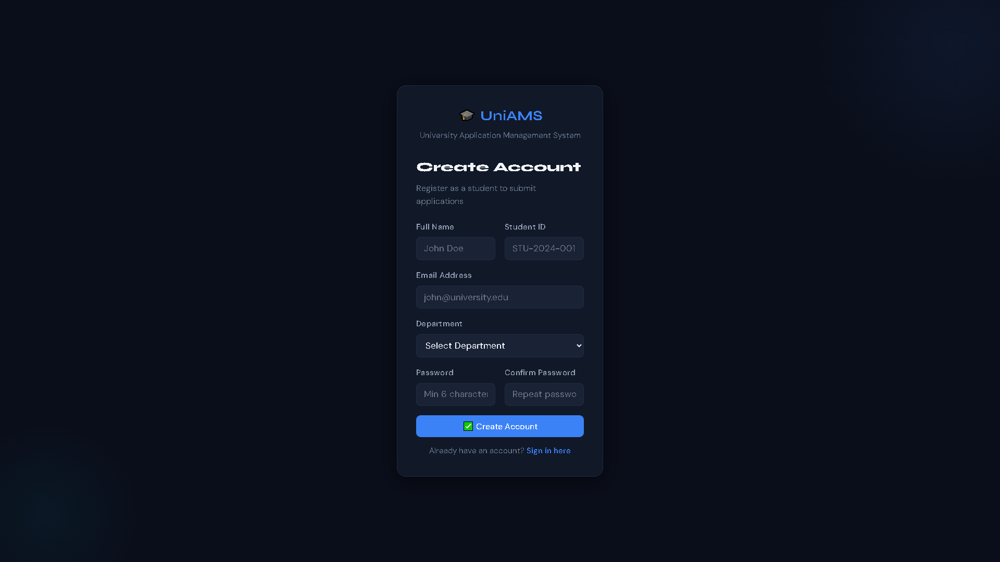
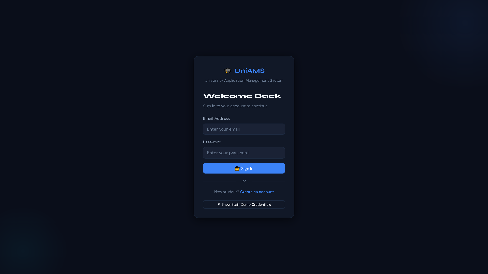
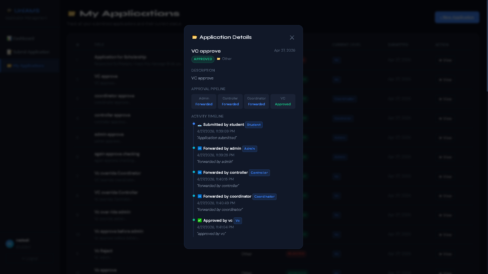
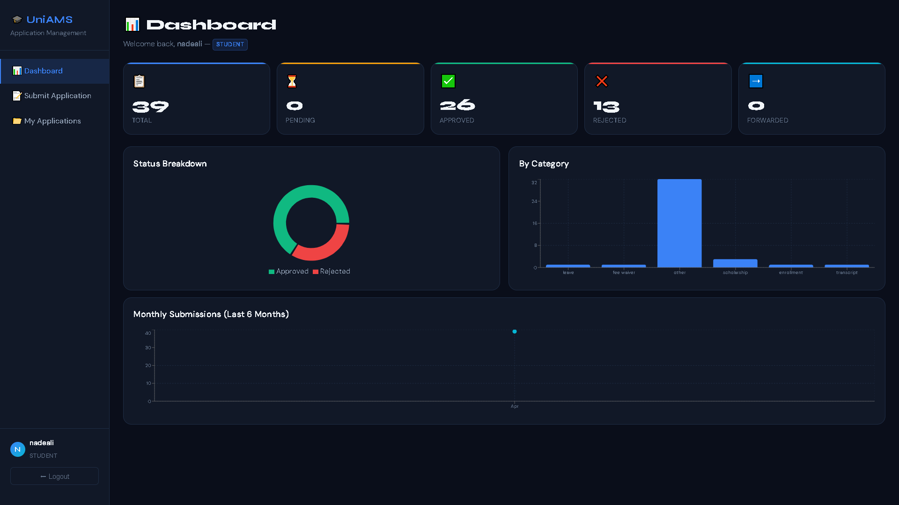
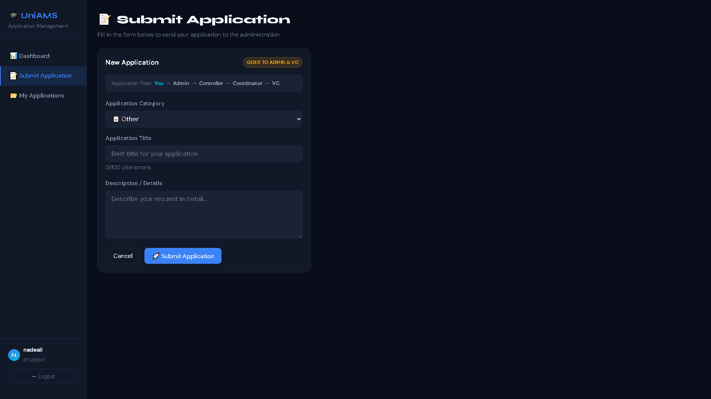
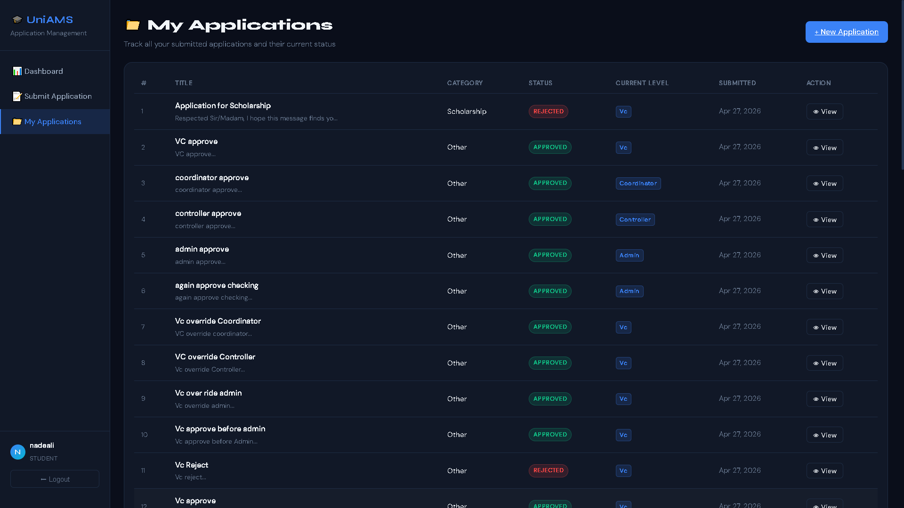
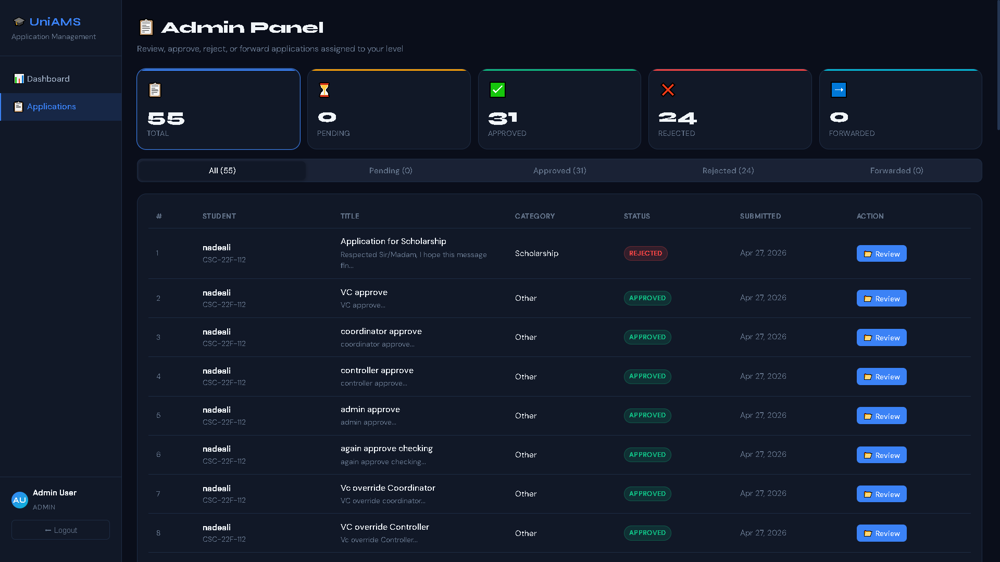
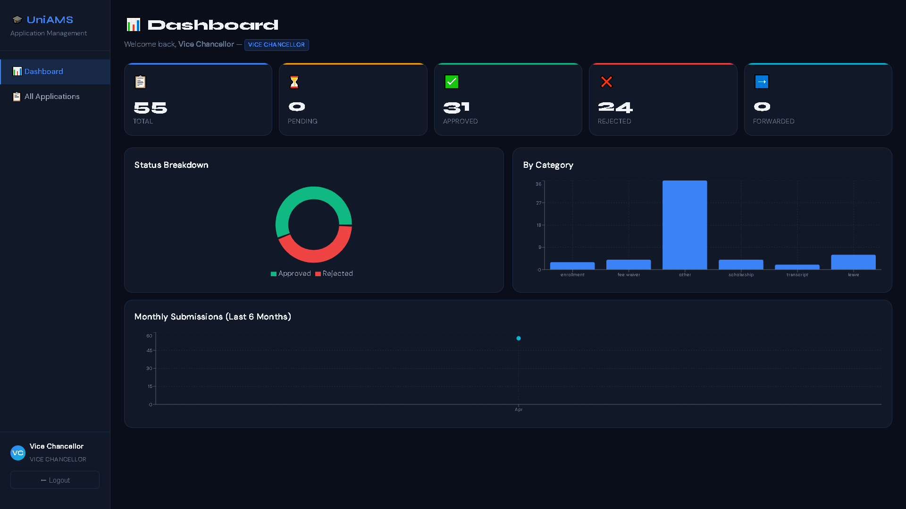
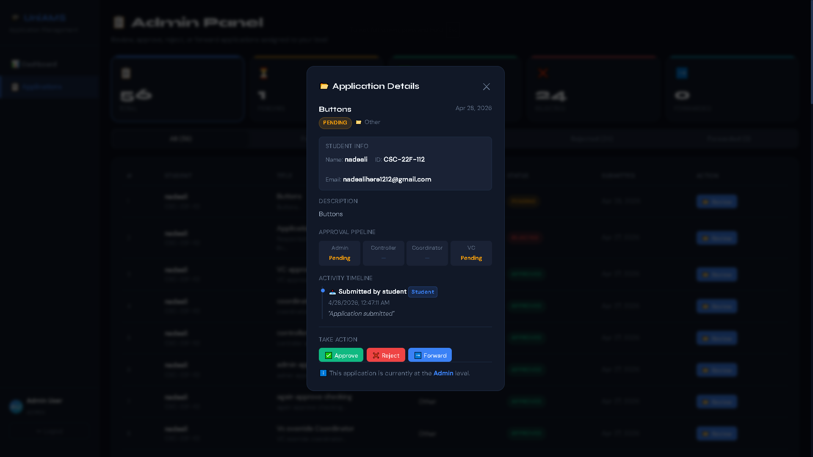
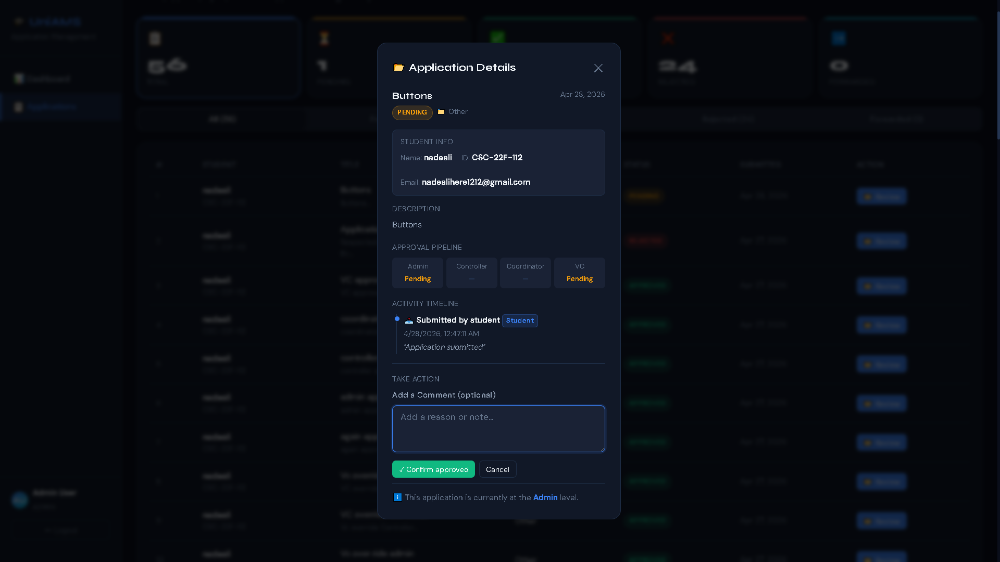

# 🎓 UniAMS – University Application Management System

A full-stack MERN application designed to manage student applications through a structured multi-level approval workflow, including a powerful Vice Chancellor (VC) override system.

---

## 🚀 Features

* 🧑‍🎓 Student Application Submission
* 🏢 Multi-Level Approval Workflow:

  * Admin → Controller → Coordinator → VC
* 🔄 Forward / Approve / Reject Actions
* 👑 VC Override System (can take action at any stage)
* 🔒 Role-Based Access Control (RBAC)
* 🕒 Activity Timeline with Comments
* 📊 Application Status Tracking:

  * Pending, Approved, Rejected, Forwarded
* 📁 Category-Based Application Management
* ⏱ Real-time status updates


---

## 🔁 Workflow

```
Student → Admin → Controller → Coordinator → VC
```

### 🔥 Special Logic

* The VC can approve or reject at any stage
* Once the VC takes action, all other roles are locked
* If no VC action is taken, the normal approval flow continues

---

## 🛠 Tech Stack

### Frontend

* React.js
* Axios
* Custom CSS

### Backend

* Node.js
* Express.js
* MongoDB
* Mongoose

---

## 📸 Screenshots

### 🔐 Signup Page


### 🔑 Login Page


### 🔄 Application Pipeline


### 🎓 Student Dashboard


### 📝 Submit Application


### 📁 Applications List


### 🛠 Admin Dashboard


### 📄 Admin Application Panel


### 🏛 VC Dashboard


### ✅ ❌ ACTION BUTTONS


### 💬 COMMENT SECTION


---

## ⚙️ Installation & Setup

### 1️⃣ Clone the Repository

```bash
git clone https://github.com/YOUR_USERNAME/UniAMS.git
cd UniAMS
```

### 2️⃣ Install Backend Dependencies

```bash
cd backend
npm install
```

### 3️⃣ Install Frontend Dependencies

```bash
cd ../frontend
npm install
```

### 4️⃣ Environment Variables

Create a `.env` file inside the backend folder:

```
PORT=5000
MONGO_URI=your_mongodb_connection_string
JWT_SECRET=your_secret_key
```

### 5️⃣ Run the Application

#### Start Backend:

```bash
cd backend
npm start
```

#### Start Frontend:

```bash
cd frontend
npm start
```

---

## 📌 Future Improvements

* 🔔 Email Notifications
* 📱 Mobile Responsive Design
* 📊 Advanced Admin Dashboard
* 📎 File Upload Support

---

## 👨‍💻 Author

**Nadeali**
MERN Stack Developer
📧 Email: [nadealihere1212@gmail.com](mailto:nadealihere1212@gmail.com)

---

## ⭐ Support

If you like this project, consider giving it a ⭐ on GitHub!
